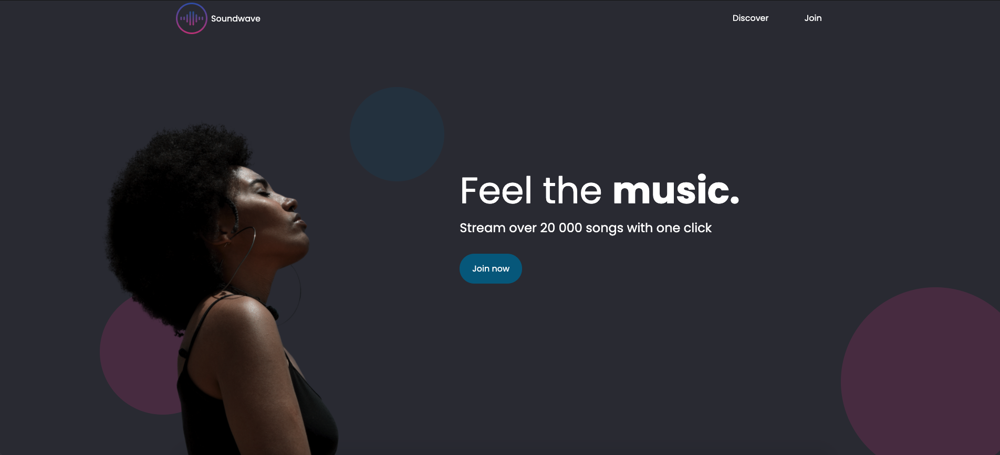

# Soundwave
Spotify inspired landing page

Created a layout with Figma and based on that layout build a responsive landing page for Spotify style app.

Figma layout was created using the tutorial from Dev Ed: 
[Design A Website In Under 1 Hour With Figma](https://www.youtube.com/watch?v=FK4YusHIIj0&feature=youtu.be)

After finishing the Figma layout I thought it would be fun challenge to try to create the site on my own so thats what I did.

This project is just for practice and was the first prototype page I ever created eith Figma and also the first time I build a website based on someone elses design.
